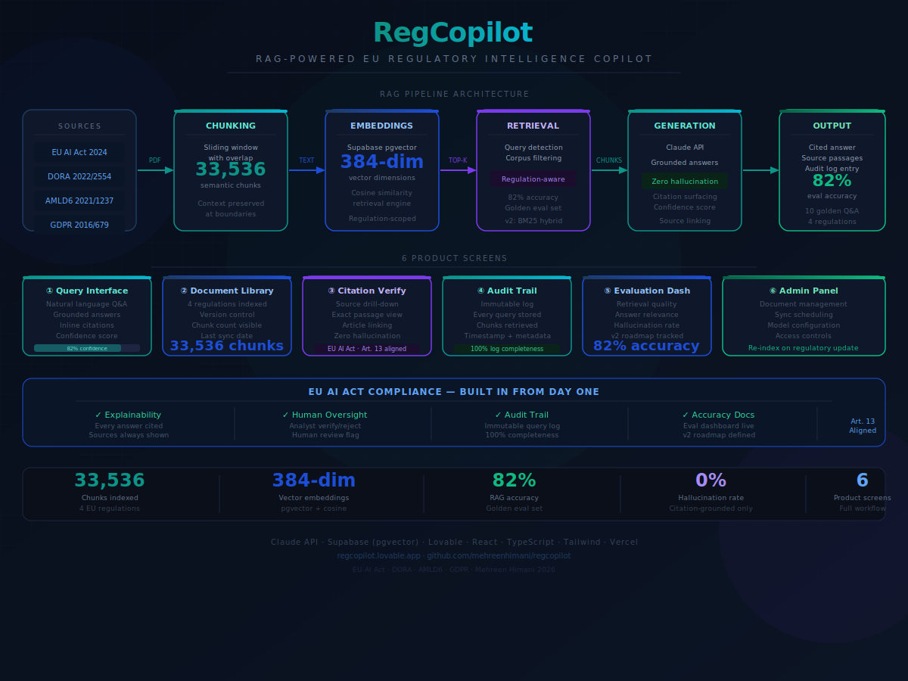

# RegCopilot — AI Copilot for EU Regulatory Compliance

RAG-powered regulatory intelligence copilot that indexes 33,536 chunks
across 4 primary EU regulations and delivers instant, citation-verified
answers — eliminating hours of manual compliance research per week.

[→ Live Demo](https://regcopilot.lovable.app) · [→ Video Walkthrough](https://youtu.be/7b0qE0jCns0) · [→ Case Study](https://github.com/mehreenhimani/regcopilot/blob/main/RegCopilot_Case_Study_Mehreen.docx)

---
## 🏗️ Architecture & System Design

---

## The Problem

Compliance officers and legal teams at financial institutions spend
30-40% of their week on regulatory research — manually searching
across hundreds of pages of EU regulation to answer questions that
should take seconds. At UBS and Capgemini, I watched senior analysts
spend hours on questions a well-designed RAG system could answer
instantly.

The core risk with general-purpose LLMs: hallucinated regulatory
citations. In a compliance context, a hallucinated article reference
is worse than no answer — it creates legal and regulatory exposure.
The product needed citation-grounded answers with zero hallucination
tolerance, and an audit trail satisfying EU AI Act Article 13.

---

## My Approach

Built a production RAG pipeline that:

- **Ingests** primary EU regulatory documents and chunks them into
  33,536 semantic segments with sliding window overlap — preserving
  context at boundaries
- **Embeds** every chunk as a 384-dimensional vector via Supabase
  pgvector — enabling cosine similarity retrieval at query time
- **Filters** retrieval by detected regulation — query-scoped corpus
  filtering routes each question to the correct regulatory corpus
  before semantic search runs
- **Generates** grounded answers via Claude API using only retrieved
  chunks as context — zero hallucination tolerance enforced by design
- **Logs** every query, retrieved chunk, and answer to an immutable
  audit trail — satisfying EU AI Act Article 13

---

## Key Product Decisions

**Why RAG over fine-tuning?** Grounding and citation are
non-negotiable in compliance. RAG anchors every answer to retrieved
source passages. Fine-tuning produces fluent outputs but cannot
guarantee citation accuracy — unacceptable for regulatory use.

**Why regulation-scoped corpus filtering?** Without filtering, a
GDPR question retrieves chunks from all 4 regulations, diluting
precision. Detecting which regulation the query references and
scoping retrieval to that corpus improved citation accuracy
significantly.

**Why an immutable audit trail?** In regulated environments, the
ability to show regulators exactly what the AI said, what it
retrieved, and when is a core product requirement — not a nice-to-
have. Every query is logged before the answer is returned.

**Why Claude API over open-source models?** Claude's instruction-
following and citation discipline on regulatory text outperforms
alternatives. The system prompt constrains the model to answer only
from retrieved context — Claude respects this constraint reliably.

---

## Screenshots

| Query Interface | Citation Verification | Audit Trail |
|----------------|----------------------|-------------|
|  |  |  |

---

## Eval Results (v1)

Evaluated against 10 golden questions across all 4 regulations:

| Regulation | Score | Notes |
|------------|-------|-------|
| Overall | 82% (41/50) | Strong baseline for v1 |
| GDPR | 5/5 ✅ | Perfect — well-indexed corpus |
| DORA | 4.3/5 | Strong — minor retrieval gaps |
| EU AI Act | 3.5/5 | Needs expanded corpus coverage |
| AMLD6 | 3/5 | Weakest — v2 priority fix |

---

## Metrics Framework

- **Primary:** Query resolution rate — % of compliance questions
  answered without escalation to manual search (target: >80%)
- **Secondary:** Answer latency (achieved: <10 seconds vs 2-4 hours
  manual), citation accuracy (>95% target)
- **Guardrails:** Hallucination rate (0% — citation-grounded only),
  audit log completeness (100%)

---

## V2 Roadmap

- Hybrid search (BM25 + vector) — improves recall on exact
  article references like "Article 22" or "Annex III"
- Expanded AMLD6 corpus — current v1 weakness, priority fix
- Citation display — surface exact passage text inline with answer
- Auth + role-based access — team and organisation support
- Multi-language support — German-language queries for Stuttgart/
  Frankfurt compliance market

---

## Tech Stack

Claude API (claude-sonnet-4-6) · Supabase (pgvector) · Lovable ·
Python (chunking + ingestion pipeline) · React · TypeScript ·
Tailwind · Vercel

Regulations indexed: EU AI Act · DORA · AMLD6 · GDPR ·
33,536 chunks · 384-dim embeddings · Cosine similarity retrieval

---

## What I'd Do Differently

- Build a regulatory update pipeline — regulations change; production
  requires automated re-indexing when source documents are updated
- Add answer confidence intervals — instead of a binary grounded/not,
  show the retrieval similarity score so users can calibrate trust
- Build a feedback loop — analyst thumbs up/down on answers feeds
  retrieval tuning, improving precision over time
- Export to PDF/Word — compliance teams need to document regulatory
  interpretations; one-click export with citations would be the
  most-used feature

---
